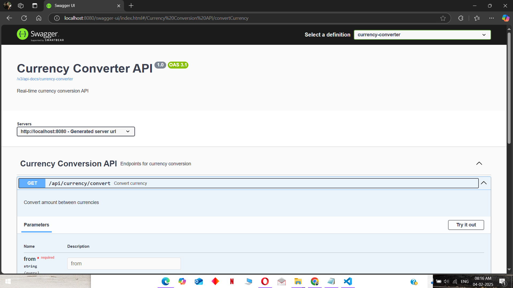
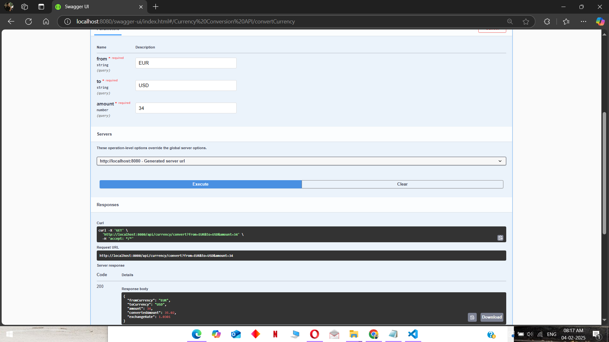
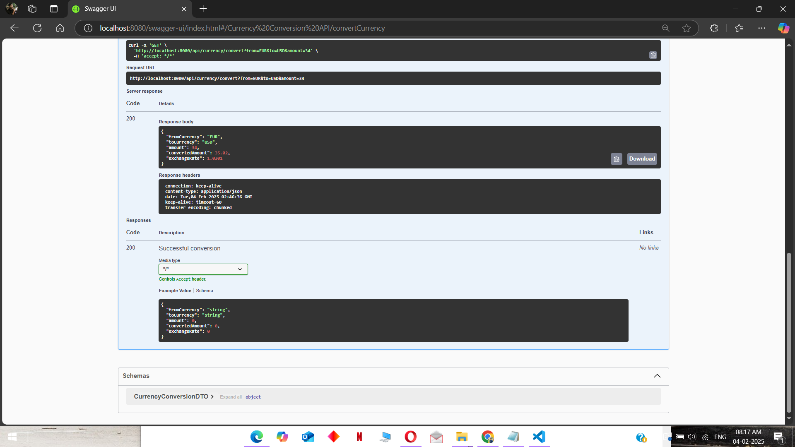

# Currency Converter API

A Spring Boot REST API for currency conversion using real-time exchange rates.

## Features
- Convert currency amounts between different currencies
- Swagger UI for API documentation
- Exception handling for invalid requests
- JUnit tests for service and controller layers

## Technologies Used
- **Spring Boot**
- **Spring Web**
- **Spring Boot Test & JUnit**
- **Lombok**
- **RestClient (Spring 6)**
- **Swagger OpenAPI**

## Prerequisites
- Java 17+
- Maven
- Internet connection for fetching live exchange rates

## Installation

### Clone the repository
```sh
git clone https://github.com/your-username/currency-converter-api.git
cd currency-converter-api
```
 
###  Build & Run the Application

mvn clean install
mvn spring-boot:run

## Run in Debug Mode

```
mvn spring-boot:run -Ddebug
```

### API Documentation
Once the application is running, access Swagger UI at:

## http://localhost:8080/swagger-ui.html

### Example API Call

## GET http://localhost:8080/api/currency/convert?from=USD&to=EUR&amount=100

### Running Tests
Run all JUnit tests with:
## mvn test

## SCREENSHOTS

### Swagger UI


### API Response Example


### API Response Example


### License

MIT License. Free to use and modify.